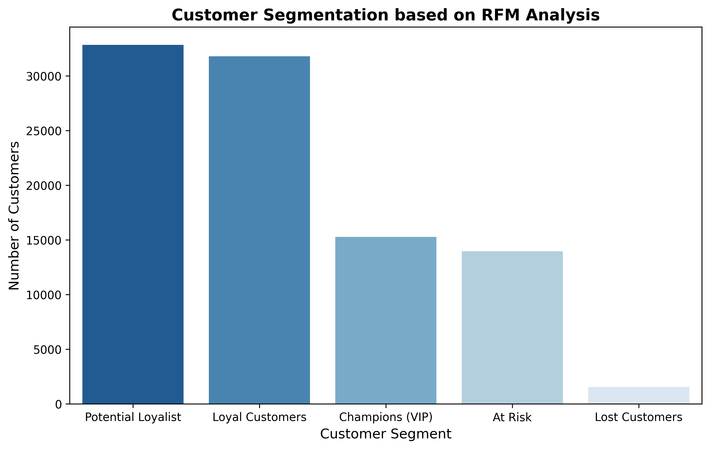

# 📊 E-Commerce Customer Segmentation (RFM Analysis)

## 📌 Project Overview
In the highly competitive e-commerce industry, understanding customer behavior is critical for retention and growth. This project focuses on segmenting over 100,000 customers from the Olist e-commerce platform using **RFM (Recency, Frequency, Monetary) Analysis**. By scoring these metrics, customers were grouped into actionable business segments to optimize targeted marketing strategies.

## 📂 Dataset Source
To maintain a clean repository, the heavy raw data files (Orders and Customers datasets) are not included. The original dataset is publicly available on Kaggle:
🔗 **[Brazilian E-Commerce Public Dataset by Olist](https://www.kaggle.com/datasets/olistbr/brazilian-ecommerce)**

## 🛠️ Tools & Technologies Used
* **Data Manipulation:** Python (Pandas, NumPy)
* **Data Visualization:** Python (Matplotlib, Seaborn)
* **Analytical Approach:** Cohort & RFM Scoring, Quantile-based Segmentation

## 📈 Visualizing Customer Segments

## 💡 Key Business Insights & Recommendations
1. **High Potential for Upselling:** The largest segment is **"Potential Loyalist"** (>32,000 customers). 
   * *Recommendation:* Launch targeted campaigns (e.g., limited-time free shipping or personalized discount vouchers) to convert them into "Champions" or "Loyal Customers".
2. **Healthy Baseline Retention:** The **"Lost Customers"** segment is significantly small (~1,500 customers), indicating that the platform's core service is retaining users well.
3. **Churn Prevention:** Nearly 14,000 customers are labeled as **"At Risk"**.
   * *Recommendation:* Implement a re-engagement email sequence or win-back promotions specifically targeting this group before they churn completely.

## 📁 Project Structure
* `rfm_analysis.ipynb`: The core Jupyter Notebook containing data merging, RFM score calculation logic, and visualization.
* `rfm_segmentation_chart.png`: The output chart showing the distribution of customer segments.