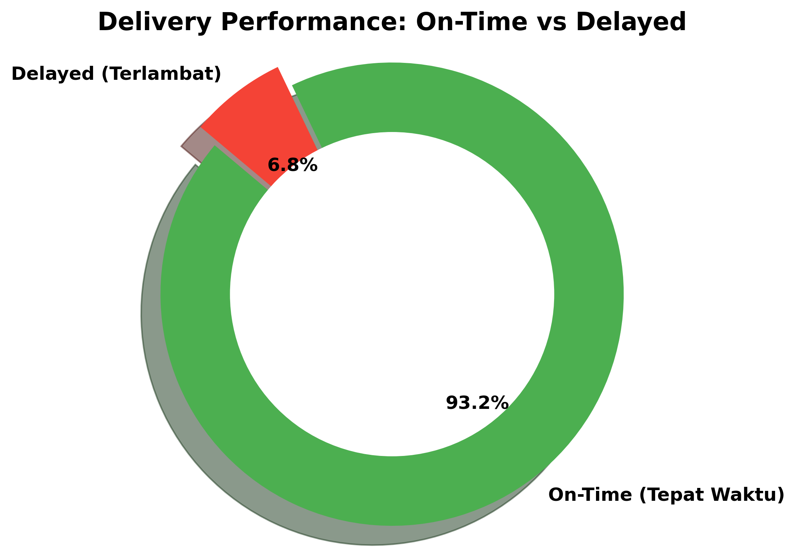

# 🚚 Logistics & Delivery Performance Analysis

## 📌 Project Overview
This project focuses on supply chain and logistics analytics by evaluating the delivery performance of the Olist e-commerce platform. The primary goal is to identify operational bottlenecks, calculate the delivery defect rate, and analyze the severity of delayed shipments.

## 🛠️ Tools & Technologies Used
* **Data Manipulation:** Python (Pandas, NumPy)
* **Data Visualization:** Python (Matplotlib, Seaborn)

## 📊 Delivery Performance Visualization

## 💡 Key Business Insights
1. **High Success Rate:** The logistics network operates efficiently overall, with **93.2%** of all orders delivered on or before the estimated date.
2. **Defect / Delay Rate:** Only **6.8%** of orders experienced delays. 
3. **Operational Recommendation:** While the delay rate is low, investigating the root cause (e.g., carrier issues, regional distance, or specific warehouse bottlenecks) for the delayed packages can further optimize customer satisfaction and reduce support ticket volumes.

## 📁 Project Structure
* `delivery_analysis.ipynb`: The Jupyter Notebook containing data type formatting, date calculations, and visualization logic.
* `delivery_status_chart.png`: The output Donut Chart showing the proportion of on-time vs delayed deliveries.